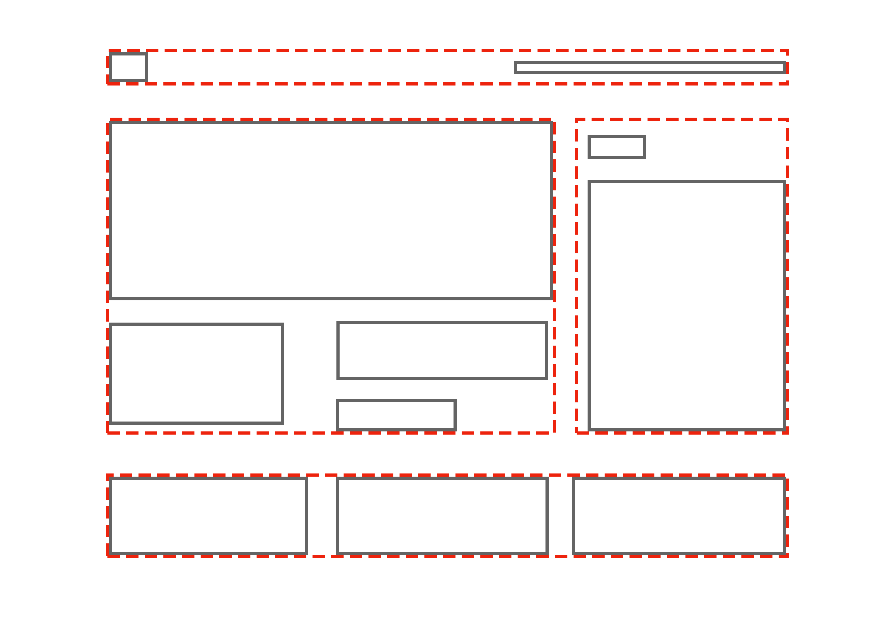

# Frontend Mentor - News homepage solution

This is a solution to the [News homepage challenge on Frontend Mentor](https://www.frontendmentor.io/challenges/news-homepage-H6SWTa1MFl). Frontend Mentor challenges help you improve your coding skills by building realistic projects.


## Table of contents

- [Overview](#overview)
  - [The challenge](#the-challenge)
  - [Screenshot](#screenshot)
  - [Links](#links)
- [My process](#my-process)
  - [Mobile-First](#mobile-first)
  - [Styling the Menu](#styling-the-menu)
  - [Built with](#built-with)
  - [What I learned](#what-i-learned)
  - [Continued development](#continued-development)
  - [Useful resources](#useful-resources)
- [Author](#author)
- [Acknowledgments](#acknowledgments)

**Note: Delete this note and update the table of contents based on what sections you keep.**

## Overview

### The challenge

Users should be able to:

- View the optimal layout for the interface depending on their device's screen size
- See hover and focus states for all interactive elements on the page

### Final Screenshot

 <!-- change this -->

### Links

- Solution URL: [Add solution URL here](https://your-solution-url.com)
- Live Site URL: [Add live site URL here](https://your-live-site-url.com)

## My process

After looking over the design files, I know I'll be implementing **css grid** the acheive a layout similar to the _Holy Grail_ template. Beore I write any HTML or CSS, however, I want to break the desktop design down even further so I can better visualize how to structure my HTML.



There will be two primary containers, the `<header>` and `<main>` elements. The header will contain two children, an `` and a `<nav>` which will contain a nested `<ul>` where the actual navigation links will reside.

The main container will nest three `<section>` elements: one for the main story, one for new stories, and another for top stories.

###### HTML Outline

```html
<header>...</header>

<main class="grid">
	<section>...</section>
	<section>...</section>
	<section>...</section>
</main>
```

### Mobile-First

Now that I have a general idea of how to acheive the desktop design, it's time to start writing the HTML. I'm taking a **mobile-first** approach which will allow me to focus solely on the content in the beginning, then I can slowly work my way up to desktop dimensions and eventually install the grid using **media queries**.

The nice thing about a barebones mobile-first design is that everything, for the most part, is already responsive with the exception of images.

###### Barebones Mobile-First CSS

```css
.main-article__img {
	width: 100%;
}
```

### Accessibility

Another focus of mine for this project is **accessibility**, which is why I'm using `<ul>` and `<ol>` elements to group information like navigation links and articles. My starting goal is to create a barebones, user-friendly and accessible page that is fully functional with as little CSS as possible (as shown below). Here's a [screenshot ](assets/images/design/phase01.png) of what I came up with.

### Styling the Menu

Now that I'm ready to implement the actual design of the page, I need to style my navigation links so they're floating on a pane that will eventually slide in and out of the viewport. Once I've got this down, I'll need to write some **JavaScript** to make my menu interactive. I'll also need to figure out how to dim the rest of the page when the navigation menu is open.

<!--

 ### Built with

- Semantic HTML5 markup
- CSS custom properties
- Flexbox
- CSS Grid
- Mobile-first workflow
- [React](https://reactjs.org/) - JS library
- [Next.js](https://nextjs.org/) - React framework
- [Styled Components](https://styled-components.com/) - For styles

**Note: These are just examples. Delete this note and replace the list above with your own choices**

### What I learned

Use this section to recap over some of your major learnings while working through this project. Writing these out and providing code samples of areas you want to highlight is a great way to reinforce your own knowledge.

To see how you can add code snippets, see below:

```html
<h1>Some HTML code I'm proud of</h1>
```
```css
.proud-of-this-css {
  color: papayawhip;
}
```
```js
const proudOfThisFunc = () => {
  console.log('🎉')
}
```

If you want more help with writing markdown, we'd recommend checking out [The Markdown Guide](https://www.markdownguide.org/) to learn more.

**Note: Delete this note and the content within this section and replace with your own learnings.**

### Continued development

Use this section to outline areas that you want to continue focusing on in future projects. These could be concepts you're still not completely comfortable with or techniques you found useful that you want to refine and perfect.

**Note: Delete this note and the content within this section and replace with your own plans for continued development.**

### Useful resources

- [Example resource 1](https://www.example.com) - This helped me for XYZ reason. I really liked this pattern and will use it going forward.
- [Example resource 2](https://www.example.com) - This is an amazing article which helped me finally understand XYZ. I'd recommend it to anyone still learning this concept.

**Note: Delete this note and replace the list above with resources that helped you during the challenge. These could come in handy for anyone viewing your solution or for yourself when you look back on this project in the future.**

## Author

- Website - [Add your name here](https://www.your-site.com)
- Frontend Mentor - [@yourusername](https://www.frontendmentor.io/profile/yourusername)
- Twitter - [@yourusername](https://www.twitter.com/yourusername)

**Note: Delete this note and add/remove/edit lines above based on what links you'd like to share.**

## Acknowledgments

This is where you can give a hat tip to anyone who helped you out on this project. Perhaps you worked in a team or got some inspiration from someone else's solution. This is the perfect place to give them some credit.

**Note: Delete this note and edit this section's content as necessary. If you completed this challenge by yourself, feel free to delete this section entirely.**

-->
